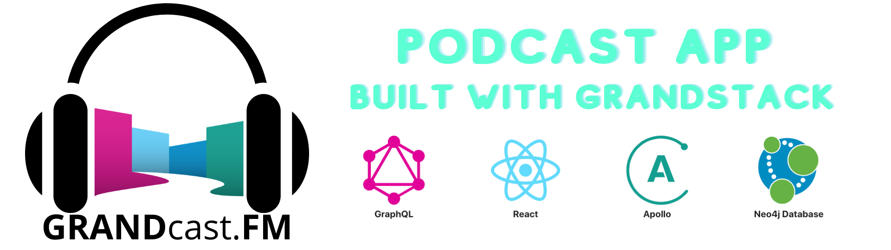

<hr>

GRANDcase.FM is a podcast application built using [GRANDstack (GraphQL, React, Apollo, Neo4j Database)](https://grandstack.io). It is being built one episode at a time on the [Neo4j Livestream](https://twitch.tv/neo4j_). You can join live at [twitch.tv/neo4j\_](https://twitch.tv/neo4j_) Thursdays at 2pm US Pacific time or watch the stream recordings below.

- **Episode 1:** Podcast Search GraphQL API ([Video recording](https://www.youtube.com/watch?v=lsGgFxGwHlw&list=PL9Hl4pk2FsvUQ5bDoLPhN_aYJNQjkQJh_&index=2), [Blog post](https://lyonwj.com/blog/grandstack-podcast-app-podcast-search-graphql-api))
- **Episode 2:** User Auth (Sign Up and Login) & Podcast Subscribe ([Video recording](https://www.youtube.com/watch?v=IOXmrIYij_g&list=PL9Hl4pk2FsvUQ5bDoLPhN_aYJNQjkQJh_), [git commit](https://github.com/johnymontana/grandcast.fm/commit/8d668bfa45ec021a76cef1af280fc8f32e13cd76), [Blog post](https://lyonwj.com/blog/grandstack-podcast-app-user-auth-podcast-subscribe))
- **Episode 3:** Parsing Podcast Feeds & Playlists ([Video recording](https://www.youtube.com/watch?v=WdClRB_-Egs&list=PL9Hl4pk2FsvUQ5bDoLPhN_aYJNQjkQJh_&index=3), [Blog post](https://lyonwj.com/blog/grandstack-podcast-app-parsing-xml-neo4j-rss-episodes-playlists), [git commit](https://github.com/johnymontana/grandcast.fm/commit/21d457a6d4efadf2118110bc8fdd47e79d4e4a72))
- **Episode 4:** Next.js & GraphQL Authentication([Video recording](https://www.youtube.com/watch?v=pB4YZBJmMl8), [git commit](https://github.com/johnymontana/grandcast.fm/commit/247aa53426901b0b2951fe152031e1efc8638341), [Blog post](https://lyonwj.com/blog/grandstack-podcast-app-next-js-graphql-authentication))
- **Episode 5:** Chakra UI Component Library([Video recording ](https://www.youtube.com/watch?v=x0_a9tOpExc), [git commit](https://github.com/johnymontana/grandcast.fm/commit/26ab595a9c561c237acdf1c994a2344728bb1836), [Blog post](https://lyonwj.com/blog/grandstack-podcast-app-chakra-ui-responsive-nav-bar-episode-component))
- **Episode 6:** Frontend Features Using Chakra UI, GraphQL, & Apollo Client (Playlists & Podcast search) ([Video recording](https://www.youtube.com/watch?v=UXD89QFg0tU), [git commit](https://github.com/johnymontana/grandcast.fm/commit/0efcb49a683ebe832cfc1ef9fb439544191d4c7d), [Blog post](https://lyonwj.com/blog/grandstack-podcast-app-chakra-ui-next-js-graphql-apollo-client))

<hr>

# This project was bootstrapped using `create-grandstack-app`

```
npx create-grandstack-app myNewApp
```

This project is a starter for building a [GRANDstack](https://grandstack.io) (GraphQL, React, Apollo, Neo4j Database) application. There are two components to the starter, the web frontend application (in React and Angular flavors) and the API app (GraphQL server).

The starter represents a **business reviews dashboard**. You need to adjust the GraphQL schema, the seed data, database index creation, and the UI components for your use-case.

[](http://www.youtube.com/watch?v=1JLs166lPcA 'Hands On With The GRANDstack Starter')

_Hands On With The GRANDstack Starter Video_

## Quickstart

The easiest way to get started with the GRANDstack Starter is to create a Neo4j Sandbox instance and use the `create-grandstack-app` command line tool.

(If you have a running Neo4j database on localhost via Neo4j Desktop or a Neo4j server installation, change the password in `api/.env`)

### 1. Create A Neo4j Instance

#### Option :one: - Sandbox

[Neo4j Sandbox](https://neo4j.com/sandbox) allows you to create a free hosted Neo4j instance private to you that can be used for development.

After singing in to Neo4j Sandbox, click the `+ New Project` button and select the "Blank Sandbox" option. In the next step we'll use the connection credentials from the "Connection details" tab to connect our GraphQL API to this Neo4j instance.


#### Option :two: - Desktop

If you instead would like to use [Neo4j Desktop](https://neo4j.com/download/). The process will be almost the same with a minor detour. Install Neo4j Desktop for your chosen OS and then make a new blank graph for your project. It will require you to put in a password and username. Remember those.

Next you need to go to open the manage screen from the options in the 3 dot stack menu


And install the apoc plugin, green button at the top of the list.


After that you can return to setting up your app with the credentials from the prior steps.

### 2. Run the `create-grandstack-app` CLI

```
npx create-grandstack-app myNewApp
```

or with Yarn

```
yarn create grandstack-app myNewApp
```


This will create a new directory `myNewApp`, download the latest release of the GRANDstack Starter, install dependencies and prompt for your connection credentials for Neo4j to connect to the GraphQL API.

### 3. Seed the database (optional)

Make sure your application is running locally with `npm start` or `yarn start`, open another terminal and run

```
npm run seedDb
```

or with Yarn

```
yarn run seedDb
```

### 4. Open In Browser


## <a name="overview"></a> Overview

The GRANDstack Starter is a monorepo that includes a GraphQL API application and client web applications for React (default) and Angular for a business reviews dashboard.

### `/` - Project Root

The root directory contains some global configuration and scripts:

- `npm run start` and `npm run build`
- ESLint (.eslintrc.json) for code linting
- Prettier (.prettierrc.json) for code formatting
- Git hooks for applying formatting on commit

### [`/api`](./api)


This directory contains the GraphQL API application using Apollo Server and neo4j-graphql.js.

- Change environment variable settings in `.env`:

```
# Use this file to set environment variables with credentials and configuration options
# This file is provided as an example and should be replaced with your own values
# You probably don't want to check this into version control!

NEO4J_URI=bolt://localhost:7687
NEO4J_USER=neo4j
NEO4J_PASSWORD=letmein

# Uncomment this line to enable encrypted driver connection for Neo4j
#NEO4J_ENCRYPTED=true

# Uncomment this line to specify a specific Neo4j database (v4.x+ only)
#NEO4J_DATABASE=neo4j

GRAPHQL_SERVER_HOST=0.0.0.0
GRAPHQL_SERVER_PORT=4001
GRAPHQL_SERVER_PATH=/graphql

```

### [`/web-react`](./web-react)


The frontend React web application is found in this directory.

It includes:

- Material UI
- React router
- Apollo Client / React Hooks
- Create React App

### [`/web-angular`](./web-angular)


A UI built with [Angular](https://angular.io), [Apollo](https://www.apollographql.com/docs/angular/) and the [Clarity Design System](https://clarity.design) is also available.

_Start the Angular UI server_

```
cd ./web-angular && npm start
```

### [`/mobile_client_flutter`](./mobile_client_flutter)


A mobile client built with [Flutter](https://flutter.dev) which supports Android, iOS, and web. See the [README](./mobile_client_flutter/README.md) for detailed setup instructions.

```
cd ./mobile_client_flutter && flutter run
```

### [`/web-react-ts`](./web-react-ts)

A UI built with [CRA](https://reactjs.org/docs/create-a-new-react-app.html)

_Start the React dev server_

```
cd ./web-react-ts && npm start
```

## Deployment

### Netlify

This monorepo can be deployed to Netlify. The frontend application will be served over Netlify's CDN and the GraphQL API will be provisioned as a serverless GraphQL API lambda function deployed to AWS (via Netlify). A netlify.toml file is included with the necessary build configurations. The following environment variables must be set in Netlify (either via the Netlify web UI or via the command line tool)

```
NEO4J_URI
NEO4J_USER
NEO4J_PASSWORD
```

See the "Hands On With The GRANDStack Starter" video linked at the beginning of this README for a walkthrough of deploying to Netlify.

### Vercel

Vercel can be used with monorepos such as grand-stack-starter. [`vercel.json`](https://github.com/grand-stack/grand-stack-starter/blob/master/vercel.json) defines the configuration for deploying with Vercel.

1. get [vercel cli](https://vercel.com/download)
2. Set the vercel secrets for your Neo4j instance:

```
vercel secret add grand_stack_starter_neo4j_uri bolt://<YOUR_NEO4J_INSTANCE_HERE>
vercel secret add grand_stack_starter_neo4j_user <YOUR_DATABASE_USERNAME_HERE>
vercel secret add grand_stack_starter_neo4j_password <YOUR_DATABASE_USER_PASSWORD_HERE>
```

3. Run `vercel`

## Docker Compose

You can quickly start via:

```
docker-compose up -d
```

If you want to load the example DB after the services have been started:

```
docker-compose run api npm run seedDb
```

See [the project releases](https://github.com/grand-stack/grand-stack-starter/releases) for the changelog.

You can find instructions for other ways to use Neo4j (Neo4j Desktop, Neo4j Aura, and other cloud services) in the [Neo4j directory README.](./neo4j)

This project is licensed under the Apache License v2.
Copyright (c) 2020 Neo4j, Inc.
